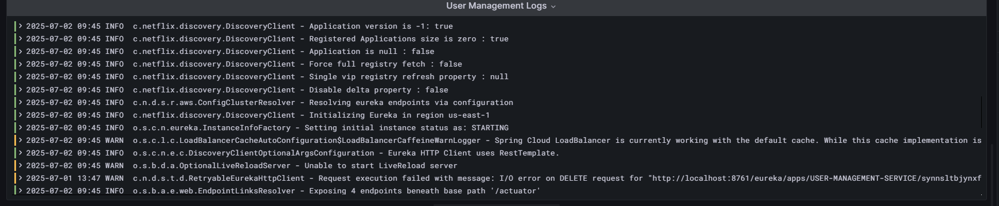
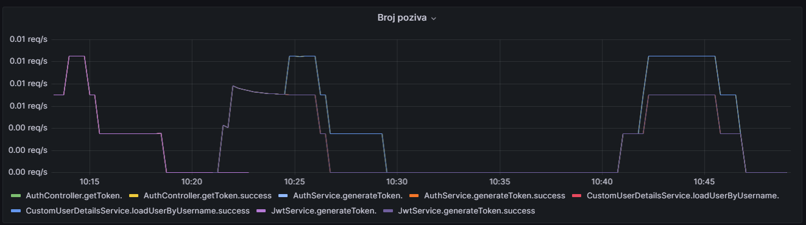
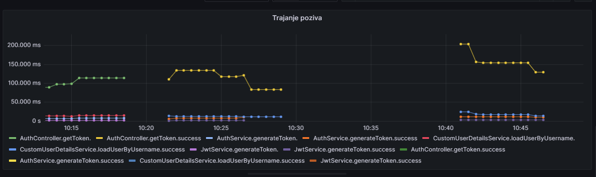

# user-managment-service

# Logging

Logs are printed to the console in the following format:
2023-07-01 12:34:56.789 INFO [main] c.e.u.UserService – Invoking getUserById(42).

In addition, all log are also written to files under the logs/ directory.

## Viewing Logs in Grafana

You can also explore your application logs directly in Grafana via Loki. Follow these steps:

### 1. Start Rancher Desktop 

### 2. Launch the logging stack
   In your project branch directory  (where `docker-compose.yml` for logging lives), in terminal run:
    
    docker-compose up -d
   
  This will bring up Grafana, Loki  and other services defined in docker-compose.yml.

### 3. Open Grafana

   Point your browser to: http://localhost:3000

### 4. Add Loki as a Data Source

   In the left menu, click Configuration → Data Sources → Add data source.
   Select Loki from the list.

   Set the URL to: http://loki:3100.
   Keep the rest as default, then click Save & test.

### 5. Explore Logs

   In the side menu, click Explore. 
   Choose Loki as the data source. 

   In the “Select label” field type 'job'. In the “Select value” field type 'spring'.

### 6. Filter by Log Level

   If you only want to see, for example, warnings or errors, adjust your query filter.

   In the query bar replace:

     {job="spring"}

   with: 
    
      {job="spring"} |= "WARN"

   or :

      {job="spring"} |= "ERROR" 

   Click Run query again to see only WARN or ERROR messages.

## Example how loogs looks like in grafana:

# Monitoring

   For monitoring we use Prometheus + Grafana, so we can visualize servise metrics.

### 1.   Start rancher desktop 

### 2. Start the monitoring stack

   In your project root (where `docker-compose.yml` for monitoring lives), run:
  
    docker-compose up -d
   
This will bring up all services defined in docker-compose.yml.

### 3.Check Prometehus

   Prometheus should be running on: http://localhost:9090 

### 4.Open Grafana

   Point your browser to: http://localhost:3000

### 5. Add Prometheus as a data source

   In the left menu, click Configuration → Data Sources → Add data source.
   Select Prometheus from the list.

   Set the URL: http://prometheus:9090

   Keep the rest as default, then click Save & test.

### 6.Explore Metrics

   In the side menu, click Explore.
   Choose Prometheus as the data source.

   In the “Metrics browser” field if you want to explore:
   1. **numbers of methods invocation -**

   In the metrics browser field enter:

      sum by (class, method, status) (
      rate(service_method_invocations_total[5m]))

   In the Legend field (Options→Legend→Custom) enter: {{class}}.{{method}}.{{status}} .
   Than press Run queries and you will see your metrics.

   2. **execution time -**

   In the metrics browser field enter:
   
      (
      sum by (class, method, status) (
      rate(service_method_latency_seconds_sum[5m])
      )
      )
      /
      (
      sum by (class, method, status) (
      rate(service_method_latency_seconds_count[5m])
      )
      )
   
   In the Legend field (Options→Legend→Custom) enter: {{class}}.{{method}}.{{status}} .
   Then press Run queries and you will see your metrics.
   
  ***You will see metrics for all class and serveces where you add annotation @Monitored .
  
## Example how graph for numbers of methods invocation looks like:

## Example how graph for execution time looks like:
 
  